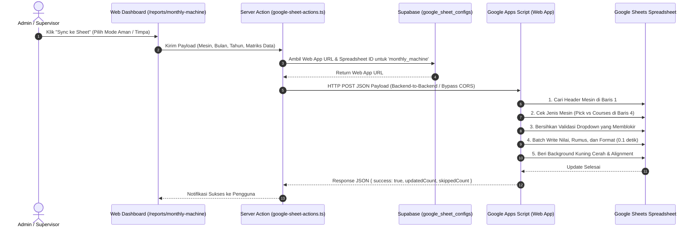

# 📄 PRD: Sistem Integrasi & Sinkronisasi Laporan ke Google Sheets
**Sistem Informasi Manajemen Produksi & QC Tekstil — PT DJI**  
*Versi Dokumen: 1.0 | Tanggal: 27 Agustus 2026*

---

## 1. 📌 Latar Belakang & Tujuan Produk

### 1.1 Masalah
Sebelumnya, rekapitulasi laporan bulanan mesin, efisiensi, cacat, dan downtime harus disalin secara manual oleh staf administrasi dari catatan fisik atau sistem ke dalam Google Sheets perusahaan. Proses manual ini memakan waktu lama, rawan salah ketik (*human error*), dan berisiko merusak rumus perhitungan efisiensi yang sudah ada.

### 1.2 Tujuan
Membangun fitur sinkronisasi otomatis satu-klik (*1-click sync*) dari aplikasi web langsung ke Google Sheets target, yang mampu:
1. Menempatkan data ke blok kolom mesin yang tepat secara dinamis.
2. Membedakan rumus efisiensi mesin kain panel (Courses) vs kain meteran (Pick).
3. Melindungi data manual yang sudah ada dengan fitur **Mode Aman (Safe Mode)**.
4. Menyeragamkan visual dan tata letak dengan highlight **Kuning Cerah (`#FFFF00`)**, rata tengah, dan format persentase otomatis.

---

## 2. 🏗️ Arsitektur & Alur Kerja Sistem (System Workflow)



---

## 3. ⚙️ Konfigurasi Dinamis Multi-Laporan (Admin Panel)

Setiap jenis laporan di aplikasi memiliki URL Google Apps Script dan Google Sheet yang berbeda. Konfigurasi ini dikelola melalui database Supabase pada tabel `public.google_sheet_configs`.

* **Halaman Pengaturan:** Menu **Integrasi Google Sheets** (`/google-sheets-config`)
* **Daftar ID Laporan:**
  * `monthly_machine`: Laporan Rekap Bulanan per Mesin
  * `mending_production`: Laporan Hasil Produksi Mending
  * `potong_kain`: Laporan Potong Kain & Roll
  * `packing_recap`: Laporan Rekapitulasi Sesi Packing

---

## 4. 📐 Aturan Pemetaan & Logika Google Apps Script

### 4.1 Pemetaan Baris Tanggal & Shift
Di Google Sheets, setiap tanggal memiliki 3 baris untuk 3 shift, dimulai dari **Baris 5**:
$$\text{Baris Target} = 5 + (\text{Tanggal} - 1) \times 3$$
* Shift 1: Baris Target
* Shift 2: Baris Target + 1
* Shift 3: Baris Target + 2

### 4.2 Pemetaan Sub-Kolom Mesin (Relative Offsets)
Dari titik kolom mesin yang ditemukan di Baris 1 (`machineStartCol`):

| Offset | Nama Kolom | Keterangan & Rumus |
| :---: | :--- | :--- |
| **+0** | Desain | Kode Desain / Motif |
| **+1** | Keterangan | Catatan Masalah Operator & Mekanik *(Rata Kiri)* |
| **+2** | Courses / Pick | Kerapatan benang |
| **+3** | RPM | Kecepatan mesin |
| **+4** | **Eff 100%** | • **Normal:** `={RPM}*8*60/{Courses}`<br>• **Meteran (Pick):** `={RPM}*8*60/({Pick}*100)` |
| **+5** | Team | Grup Shift (A / B / C) |
| **+6** | Nama Operator | Nama operator shift terkait |
| **+7** | Hasil Produksi | Jumlah panel atau meter kain yang diproduksi |
| **+8** | **Persentase dari 100%** | Rumus: `={HasilProduksi}/{Eff100%}` *(Format 0.00%)* |
| **+9** | Jumlah Cacat | Total temuan cacat |
| **+10** | **Persentase Cacat** | Rumus: `={JumlahCacat}/{HasilProduksi}` *(Format 0.00%)* |
| **+11 s.d. +21** | Kode Tindakan A s.d. L | Distribusi cacat per kode tindakan perbaikan |
| **+22** | **Jumlah Beam (Khusus L)** | **Diisi durasi Downtime mesin format `HH:MM:SS`** |

### 4.3 Aturan Format Visual
1. **Background Color:** Menggunakan **Kuning Cerah (`#FFFF00`)** untuk menandai baris yang diisi dari sistem web.
2. **Alignment:** Seluruh kolom diseragamkan **Rata Tengah (`Center`) & Rata Vertikal (`Middle`)**, kecuali kolom **Keterangan** yang dibuat **Rata Kiri (`Left`)**.
3. **Data Validation:** Script otomatis menghapus validasi dropdown yang memblokir penulisan nama operator baru (`clearDataValidations()`).

---

## 5. 🛡️ Mode Sinkronisasi (Business Modes)

Saat menekan tombol **Sync ke Sheet**, pengguna diberikan 2 opsi keamanan:

1. 🛡️ **Mode Aman (Safe Mode - Direkomendasikan):**
   * Script memeriksa apakah pada sel Operator atau Hasil Produksi di Google Sheets sudah terdapat isian data.
   * Jika sel sudah terisi data manual oleh staf, baris tersebut akan **dilewati (*skip*)** dan tidak akan ditimpa.
2. 🔄 **Mode Perbarui Semua (Overwrite Mode):**
   * Script akan memperbarui seluruh 31 tanggal pada mesin yang dipilih sesuai dengan data terbaru yang ada di database web.

---

## 6. 📖 Panduan Standard Operating Procedure (SOP) Setup Google Apps Script

Jika Anda ingin memasang script ini ke Google Spreadsheet baru atau mengupdate script lama, ikuti langkah berikut:

### Langkah 1: Buka Editor Apps Script
1. Buka Google Sheet target di browser.
2. Klik menu **Extensions $\rightarrow$ Apps Script**.

### Langkah 2: Masukkan Kode Script
Hapus kode bawaan, lalu tempelkan kode lengkap berikut:

```javascript
/**
 * GOOGLE APPS SCRIPT: SINKRONISASI LAPORAN BULANAN
 * PT DJI - PRODUCTION MANAGEMENT SYSTEM
 */
function doPost(e) {
  try {
    if (!e || !e.postData || !e.postData.contents) {
      return ContentService.createTextOutput(
        JSON.stringify({ success: false, error: "No payload received" })
      ).setMimeType(ContentService.MimeType.JSON);
    }

    var payload = JSON.parse(e.postData.contents);
    var ss = SpreadsheetApp.getActiveSpreadsheet();

    // 1. Tentukan Nama Tab Sheet (misal: "Agustus 2026")
    var monthNames = [
      "", "Januari", "Februari", "Maret", "APRIL", "Mei", "Juni", 
      "Juli", "Agustus", "September", "Oktober", "November", "Desember"
    ];
    
    var sheetName = payload.sheetName;
    if (!sheetName && payload.month && payload.year) {
      var mName = monthNames[Number(payload.month)] || "Januari";
      sheetName = mName + " " + payload.year;
    }

    var sheet = ss.getSheetByName(sheetName);
    if (!sheet) {
      var allSheets = ss.getSheets();
      for (var i = 0; i < allSheets.length; i++) {
        if (allSheets[i].getName().toLowerCase() === (sheetName || "").toLowerCase()) {
          sheet = allSheets[i];
          break;
        }
      }
    }

    if (!sheet) {
      return ContentService.createTextOutput(
        JSON.stringify({ success: false, error: "Sheet '" + sheetName + "' tidak ditemukan di Google Sheets ini!" })
      ).setMimeType(ContentService.MimeType.JSON);
    }

    // 2. Cari Posisi Kolom Mesin di Baris 1
    var targetMachine = (payload.machine || "R1").trim().toUpperCase();
    var lastCol = Math.max(sheet.getLastColumn(), 400);
    var row1Values = sheet.getRange(1, 1, 1, lastCol).getValues()[0];
    
    var machineStartCol = -1;
    for (var colIdx = 0; colIdx < row1Values.length; colIdx++) {
      var cellVal = String(row1Values[colIdx] || "").trim().toUpperCase();
      if (cellVal === targetMachine) {
        machineStartCol = colIdx + 1;
        break;
      }
    }

    if (machineStartCol === -1) {
      return ContentService.createTextOutput(
        JSON.stringify({ success: false, error: "Mesin '" + targetMachine + "' tidak ditemukan di Baris 1 sheet '" + sheetName + "'!" })
      ).setMimeType(ContentService.MimeType.JSON);
    }

    // 3. Cek apakah Mesin ini Meteran (Pick) atau Normal (Courses) dari Baris 4
    var headerCol2 = String(sheet.getRange(4, machineStartCol + 2).getValue() || "").trim().toUpperCase();
    var isMeterMachine = (headerCol2 === "PICK" || payload.isMeterMachine === true);

    // 4. Persiapkan Matriks Blok Mesin (93 Baris x 23 Kolom)
    var numRows = 93;
    var numCols = 23;
    var targetRange = sheet.getRange(5, machineStartCol, numRows, numCols);
    
    var currentValues = targetRange.getValues();
    var currentFormulas = targetRange.getFormulas();
    var currentBackgrounds = targetRange.getBackgrounds();

    var matrix = [];
    for (var r = 0; r < numRows; r++) {
      var row = [];
      for (var c = 0; c < numCols; c++) {
        var form = currentFormulas[r][c];
        if (form && String(form).trim() !== "") {
          row.push(form);
        } else {
          row.push(currentValues[r][c]);
        }
      }
      matrix.push(row);
    }

    // Huruf Kolom untuk Rumus Dinamis
    var colLetterD = getColumnLetter(machineStartCol + 2);
    var colLetterE = getColumnLetter(machineStartCol + 3);
    var colLetterF = getColumnLetter(machineStartCol + 4);
    var colLetterI = getColumnLetter(machineStartCol + 7);
    var colLetterK = getColumnLetter(machineStartCol + 9);

    var items = payload.items || [];
    var webDataMap = {};
    items.forEach(function(item) {
      var tgl = Number(item.tanggal);
      if (tgl >= 1 && tgl <= 31) {
        var teams = item.teams || [];
        teams.forEach(function(tData, sIdx) {
          if (sIdx <= 2) {
            var rowOffset = (tgl - 1) * 3 + sIdx;
            webDataMap[rowOffset] = tData;
          }
        });
      }
    });

    var isSafeMode = payload.safeMode === true;
    var updatedCount = 0;
    var skippedCount = 0;
    var actionCodes = ["A", "B", "C", "D", "E", "F", "G", "H", "J", "K", "L"];
    var SYNC_BG_COLOR = "#FFFF00"; // Kuning Cerah

    // 5. Update Matriks
    for (var r = 0; r < numRows; r++) {
      var actualRowNum = 5 + r;
      var tData = webDataMap[r];
      var rowVals = matrix[r];

      // Pasang Rumus Efisiensi & Persentase
      if (!rowVals[4] || String(rowVals[4]).charAt(0) !== "=") {
        if (isMeterMachine) {
          rowVals[4] = "=" + colLetterE + actualRowNum + "*8*60/(" + colLetterD + actualRowNum + "*100)";
        } else {
          rowVals[4] = "=" + colLetterE + actualRowNum + "*8*60/" + colLetterD + actualRowNum;
        }
      }
      if (!rowVals[8] || String(rowVals[8]).charAt(0) !== "=") {
        rowVals[8] = "=" + colLetterI + actualRowNum + "/" + colLetterF + actualRowNum;
      }
      if (!rowVals[10] || String(rowVals[10]).charAt(0) !== "=") {
        rowVals[10] = "=" + colLetterK + actualRowNum + "/" + colLetterI + actualRowNum;
      }

      if (!tData) continue;

      var existingOp = String(currentValues[r][6] || "").trim();
      var existingProd = Number(currentValues[r][7] || 0);
      var hasExisting = existingOp !== "" || existingProd > 0;

      if (isSafeMode && hasExisting) {
        skippedCount++;
        continue;
      }

      var hasWebData = (tData.operator_name && tData.operator_name.trim() !== "") ||
                       (Number(tData.hasil_produksi) > 0) ||
                       (tData.keterangan && tData.keterangan.trim() !== "") ||
                       (Number(tData.jumlah_cacat) > 0) ||
                       (tData.desain && tData.desain.trim() !== "");

      if (!hasWebData) continue;

      if (tData.desain) rowVals[0] = tData.desain;
      if (tData.keterangan !== undefined) rowVals[1] = tData.keterangan || "";
      if (tData.courses) rowVals[2] = Number(tData.courses) || tData.courses;
      if (tData.rpm) rowVals[3] = Number(tData.rpm) || tData.rpm;
      if (tData.team) rowVals[5] = tData.team;
      if (tData.operator_name) rowVals[6] = tData.operator_name;
      rowVals[7] = Number(tData.hasil_produksi || 0);
      rowVals[9] = Number(tData.jumlah_cacat || 0);

      if (tData.kode_tindakan) {
        actionCodes.forEach(function(code, cIdx) {
          rowVals[11 + cIdx] = Number(tData.kode_tindakan[code] || 0);
        });
      }

      if (tData.downtime_formatted && tData.downtime_formatted !== "00:00:00") {
        rowVals[22] = tData.downtime_formatted;
      } else if (tData.downtime_detik && tData.downtime_detik > 0) {
        rowVals[22] = formatSecondsToHHMMSS(tData.downtime_detik);
      } else {
        rowVals[22] = "";
      }

      for (var colI = 0; colI < numCols; colI++) {
        currentBackgrounds[r][colI] = SYNC_BG_COLOR;
      }

      updatedCount++;
    }

    // 6. Bersihkan validasi dropdown
    sheet.getRange(5, machineStartCol + 6, numRows, 1).clearDataValidations();
    sheet.getRange(5, machineStartCol + 5, numRows, 1).clearDataValidations();

    // 7. Eksekusi Batch Write
    targetRange.setValues(matrix);
    targetRange.setBackgrounds(currentBackgrounds);
    sheet.getRange(5, machineStartCol + 8, numRows, 1).setNumberFormat("0.00%");
    sheet.getRange(5, machineStartCol + 10, numRows, 1).setNumberFormat("0.00%");
    targetRange.setHorizontalAlignment("center");
    targetRange.setVerticalAlignment("middle");
    sheet.getRange(5, machineStartCol + 1, numRows, 1).setHorizontalAlignment("left");

    return ContentService.createTextOutput(
      JSON.stringify({ 
        success: true, 
        message: "Sukses! " + updatedCount + " baris berhasil disinkronkan.",
        updatedCount: updatedCount,
        skippedCount: skippedCount
      })
    ).setMimeType(ContentService.MimeType.JSON);

  } catch (err) {
    return ContentService.createTextOutput(
      JSON.stringify({ success: false, error: err.toString() })
    ).setMimeType(ContentService.MimeType.JSON);
  }
}

function formatSecondsToHHMMSS(totalSec) {
  if (!totalSec || totalSec <= 0) return "";
  var hours = Math.floor(totalSec / 3600);
  var minutes = Math.floor((totalSec % 3600) / 60);
  var seconds = totalSec % 60;
  var pad = function(n) { return (n < 10 ? "0" : "") + n; };
  return pad(hours) + ":" + pad(minutes) + ":" + pad(seconds);
}

function getColumnLetter(colIndex) {
  var temp = 0;
  var letter = "";
  while (colIndex > 0) {
    temp = (colIndex - 1) % 26;
    letter = String.fromCharCode(temp + 65) + letter;
    colIndex = Math.floor((colIndex - temp - 1) / 26);
  }
  return letter;
}
```

### Langkah 3: Deploy sebagai Web App
1. Klik tombol biru **Deploy $\rightarrow$ New deployment**.
2. Pilih tipe: **Web app**.
3. Atur konfigurasi wajib berikut:
   * **Execute as:** `Me (akun Anda)`
   * **Who has access:** `Anyone` *(Wajib Anyone agar server aplikasi Next.js dapat mengirimkan data)*
4. Klik **Deploy**, izinkan otorisasi akun Google Anda (*Authorize Access $\rightarrow$ Advanced $\rightarrow$ Go to script (unsafe)*).
5. Salin **Web App URL** yang dihasilkan (berakhiran `/exec`).

### Langkah 4: Hubungkan ke Aplikasi Web
1. Buka dashboard web aplikasi $\rightarrow$ Menu **Integrasi Google Sheets** (`/google-sheets-config`).
2. Cari kartu **Laporan Bulanan Mesin (`monthly_machine`)**.
3. Tempelkan Web App URL dan Spreadsheet ID.
4. Klik **Simpan Pengaturan**. Sinkronisasi sudah aktif dan siap digunakan!

---

## 7. ❓ FAQ & Troubleshooting

### Q1: Mengapa perubahan hasil sync tidak bisa di-`Ctrl + Z` di Google Sheets?
* **Jawaban:** Script dieksekusi secara programatis di server Google (*cloud backend*), bukan melalui ketikan keyboard browser lokal.
* **Solusi Pemulihan:** Buka menu **File $\rightarrow$ Version history $\rightarrow$ See version history** (`Ctrl + Alt + Shift + H`), lalu klik versi beberapa menit lalu dan tekan **"Restore this version"**.

### Q2: Mengapa muncul error `Cannot set values: violates data validation rules`?
* **Jawaban:** Kolom Operator atau Team di Google Sheets memiliki aturan dropdown data validation yang kaku.
* **Solusi:** Script sudah menyertakan fungsi `clearDataValidations()` otomatis pada kolom tersebut sebelum menulis nilai.

### Q3: Bagaimana jika ada kode mesin baru di masa depan?
* **Jawaban:** Cukup tulis nama mesin baru tersebut di **Baris 1** pada kolom awal mesin di Google Sheet. Script akan mendeteksinya secara otomatis tanpa perlu mengubah baris kode apa pun.

---

## 8. ⏰ Fitur Otomatisasi Jadwal Sync & Pilihan Baris/Tanggal Spesifik

### 8.1 Pengaturan Jam Otomatis di Web ([`/google-sheets-config`](file:///c:/Users/DWIKY%20SUMARLIN/Documents/PORTOFOLIO/dji/app/%28dashboard%29/google-sheets-config/page.tsx))
* Admin/Supervisor dapat mengatur jam berapa sinkronisasi otomatis dijalankan setiap hari langsung dari halaman web (misal: `07:00`, `08:30`, `09:00` WIB).
* Pengaturan mencakup:
  1. **Waktu Eksekusi Harian:** Input jam berformat WIB (`HH:MM`).
  2. **Status Auto-Sync:** Toggle Aktif / Nonaktif.
  3. **Mode Eksekusi:** Mode Aman (hanya isi yang kosong) vs Timpa Semua.
  4. **Uji Auto-Sync Sekarang:** Tombol untuk mencoba eksekusi seluruh mesin langsung dari kartu jadwal.
* Data jadwal tersimpan di database `google_sheet_configs` (`id = 'auto_sync_schedule'`).

### 8.2 Pilihan Cakupan Tanggal / Baris Tertentu (Selective Date Scope)
* Di dalam modal **Sync ke Sheet** (baik per mesin maupun semua mesin), pengguna dapat memilih cakupan baris yang ingin disinkronkan:
  - **Opsi 1: Semua Tanggal (1 s.d. 31)** $\rightarrow$ Menulis atau menyinkronkan seluruh 31 hari dalam bulan tersebut.
  - **Opsi 2: Pilih Tanggal Tertentu (Range Picker)** $\rightarrow$ Memungkinkan pengguna memilih rentang tanggal spesifik (misal: hanya **Tanggal 26 s.d. 27**).
* **Keamanan Data:** Jika memilih rentang tanggal tertentu, Google Apps Script hanya akan memproses baris pada tanggal tersebut (misal baris shift tanggal 26 & 27), sedangkan **seluruh tanggal lainnya (1-25 dan 28-31) 100% aman dan tidak tersentuh sama sekali**. Hal ini sangat mempermudah perbaikan (*fixing*) jika ada revisi data di hari tertentu tanpa mengganggu hari-hari lain di spreadsheet.

### 8.3 Endpoint API Cron & Konfigurasi
* **Endpoint API:** `GET/POST /api/cron/sync-monthly-machine`
  - Parameter Query Opsional: `?month=8&year=2026&startDay=26&endDay=27&safeMode=true&force=true`
* **Konfigurasi Cron (`vercel.json`):**
  ```json
  {
    "crons": [
      {
        "path": "/api/cron/sync-monthly-machine",
        "schedule": "0 2 * * *"
      }
    ]
  }
  ```